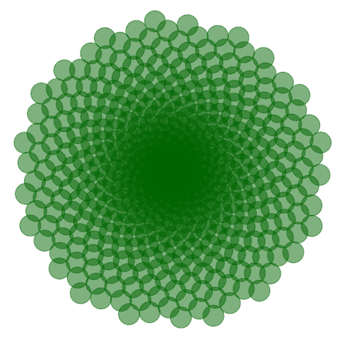

# Phyllotaxis: Draw Flowers Using Mathematics

    

This project, titled "Phyllotaxis: Draw Flowers Using Mathematics," is part of DataCamp's interactive learning platform. It explores the beauty of mathematical patterns in nature and how to create stunning visual representations using R and the ggplot2 package.

## Introduction

Nature is full of mathematical patterns that can be described and visualized through data analysis. In this project, we delve into the world of phyllotaxis, where we study how plants arrange their leaves and seeds in spirals. Inspired by these natural phenomena, we will create captivating artistic images that showcase the harmony and aesthetics found in nature.

## Project Overview

This project is divided into several tasks, each building upon the previous one. Here's a brief overview of what we'll cover:

1. **Drawing Points on a Circle:** We start by drawing points on a circle to get familiar with ggplot2 and basic plotting in R.

2. **Making It Harmonious with the Golden Angle:** We introduce the concept of the Golden Angle and use it to create a beautiful spiral pattern.

3. **Removing Everything Unnecessary:** We clean up our plot by removing unnecessary elements like gridlines, ticks, and axis labels to focus on the beauty of the pattern.

4. **A Bit of Makeup: Size, Color, and Transparency:** We enhance the appearance of our plot by adjusting the size, color, and transparency of the points.

5. **Play with Aesthetics: The Dandelion:** We make the appearance of the points dependent on a variable in the dataset, changing the size and shape to create a dandelion-like image.

6. **Put It All Together: The Sunflower:** Inspired by the arrangement of sunflower seeds, we modify the shape and color of the points, as well as the background color, to create a sunflower-like pattern.

7. **What If You Modify the Angle?** We explore how small changes to the angle between points can result in different patterns.

8. **All Together Now: Imaginary Flowers:** We encourage experimentation by allowing you to change the angle and number of points to create your own unique floral patterns.

## Conclusion

The techniques learned in this project not only allow you to create mesmerizing art but also provide valuable insights into data visualization using ggplot2. Explore the fascinating world of mathematical patterns in nature and unleash your creativity to generate beautiful, imaginary flowers.

Enjoy your journey from simple circles to intricate floral designs, and have fun exploring the harmonious relationship between mathematics and art!